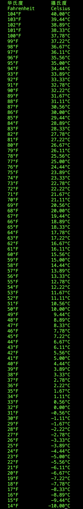
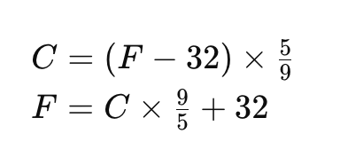

# F2C Project

The F2C (Fahrenheit to Celsius) project is designed to create a vertical table displaying temperature conversions from Fahrenheit to Celsius. The objective is to provide a comprehensive and easy-to-read reference for converting temperatures between these two scales.

## Table Layout

The table is organized with Fahrenheit degrees on the left column and their corresponding Celsius degrees on the right column. The table is arranged in descending order, starting from 40°C at the top and going down to -10°C at the bottom. Each row represents a 1°F increment in temperature, allowing for precise conversion between Fahrenheit and Celsius degrees.

## Implementation in Go

This project is implemented using the Go programming language. The choice of Go provides a straightforward and efficient way to handle the calculations and data presentation needed for this temperature conversion table.

## Code Construction

The code is built around the standard conversion formula between Fahrenheit and Celsius temperatures. The formula used for converting Fahrenheit to Celsius is as follows:

  
\[ C = (F - 32) \times \frac{5}{9} \]

Where `C` represents the temperature in Celsius, and `F` represents the temperature in Fahrenheit. This formula is integrated into the Go code to generate the conversion table dynamically, ensuring accurate and reliable temperature conversions throughout the specified range.